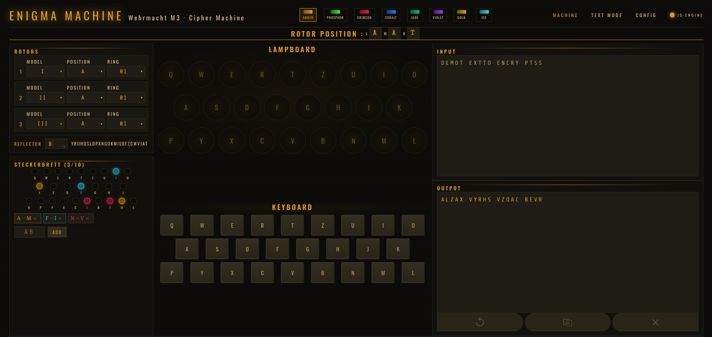
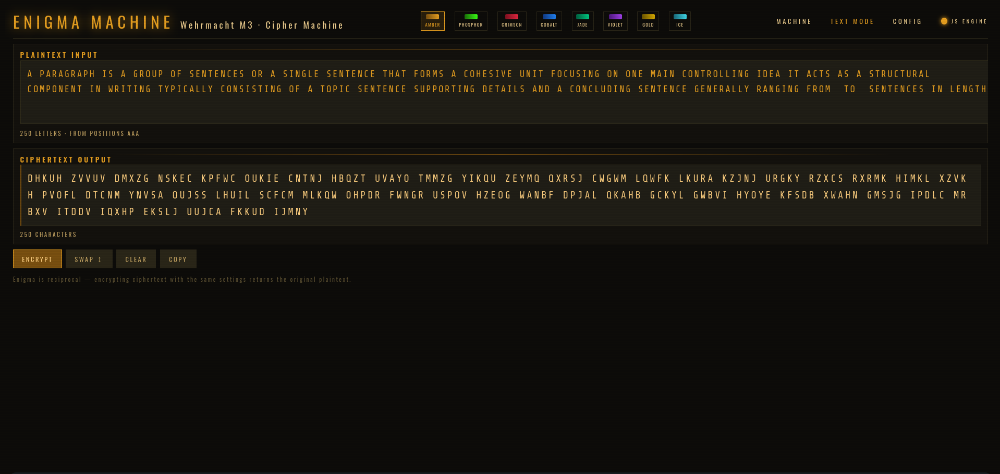

# 🔐 Enigma M3 – Wehrmacht Cipher Machine Simulator

A historically accurate, fully interactive **Enigma M3 cipher machine** built as a modern web application — simulating the real electromechanical encryption device used by the German Wehrmacht in World War II.

This project implements the **complete Enigma algorithm** in JavaScript including rotor stepping, ring settings, the double-stepping anomaly, plugboard substitution, and reflector routing — packaged in a **retro-industrial UI** with multiple color themes and a fully modular React architecture.

---




---

## 🚀 Live Demo

🔗 **Try the Enigma Machine:**  
👉 *(deploy link here)*

---

## 🏗️ Architecture Highlights

- Fully modular **React component architecture** with clean separation of concerns
- Pure JavaScript **Enigma engine** — zero dependencies, historically accurate
- `data-theme` attribute system for 8 live-switchable color themes
- `useRef` + `useCallback` pattern for zero-stale-closure keyboard encryption
- Tailwind CSS utility-first styling with CSS custom properties for theming
- Reusable UI primitives — `Pane`, `Sel`, `Field` used across all components

---

## ⚡ Performance & Accuracy

- Rotor stepping with correct **double-stepping anomaly** (middle rotor quirk)
- All 8 historical Wehrmacht/Luftwaffe rotors (I–VIII) with accurate wiring tables
- Reflectors A, B, C, B-thin, C-thin — all historically verified
- Ring settings (Ringstellung) applied with correct offset arithmetic
- Plugboard (Steckerbrett) — up to 10 pairs, each color-coded uniquely
- Physical keyboard input with focus-trap so plugboard input never leaks to encryption

---

## 🧩 Features

- ⌨️ Interactive QWERTZ keyboard with physical key support and press animation
- 💡 Lampboard that lights the encrypted output letter in real time
- 🔄 Live rotor position display updating after every keypress
- 🔌 Color-coded plugboard — each of the 10 pairs gets a unique color
- 🎨 8 switchable color themes (Amber, Phosphor, Crimson, Cobalt, Jade, Violet, Gold, Ice)
- 📝 String encryption mode with full corner-case handling and character map
- ⚠️ Stale config detection — warns when output no longer matches current settings
- 📋 Copy raw or grouped (5-letter Enigma standard) output to clipboard
- 💾 Save, load, import and export configurations as JSON
- ⚡ Quick presets — Default M3, Barbarossa, Naval, No Plugboard
- 🖥️ Single-screen no-scroll Machine tab layout

---

## 🚀 Tech Stack

| Category | Technologies |
|---|---|
| **Frontend** | React.js (Vite), JavaScript (ES6+), JSX |
| **Styling** | Tailwind CSS, CSS Custom Properties |
| **Cipher Engine** | Vanilla JavaScript — no libraries |
| **State Management** | React Hooks (useState, useRef, useCallback) |
| **Theming** | `data-theme` attribute + CSS variable overrides |
| **Version Control** | Git & GitHub |

---

## ⚙️ Setup & Installation

### 🌐 Clone Repository

```
git clone https://github.com/fmfuad0/enigma-m3.git

cd enigma-m3
```

### 🔍 Install Dependencies

```
npm install
```

### ▶️ Run Project

```
npm run dev
```

### Open web browser and visit

```
http://localhost:5173 (or any other port if 5173 is busy)
```

---

## 📁 Folder Structure

```
enigma-m3/
│
├── screenshots/
├── src/
│   ├── engine/
│   │   └── enigma.js              # Pure Enigma algorithm — rotor, reflector, plugboard
│   │
│   ├── constants/
│   │   └── index.js               # Rotor options, themes, presets, default config
│   │
│   ├── components/
│   │   ├── ui/
│   │   │   ├── Pane.jsx           # Reusable panel card
│   │   │   ├── Sel.jsx            # Compact select input
│   │   │   └── Field.jsx          # Label + control wrapper
│   │   │
│   │   ├── machine/
│   │   │   ├── MachineTab.jsx     # Two-column machine layout
│   │   │   ├── RotorAssembly.jsx  # 3 rotors + reflector selector
│   │   │   ├── PlugboardEditor.jsx# Socket grid + color-coded pairs
│   │   │   ├── Lampboard.jsx      # Lit lamp display + position chips
│   │   │   ├── EnigmaKeyboard.jsx # QWERTZ keyboard + physical input
│   │   │   └── TapeStrip.jsx      # Input/output tape with actions
│   │   │
│   │   ├── tabs/
│   │   │   ├── TextTab.jsx        # String encryption with validation
│   │   │   └── ConfigTab.jsx      # Save / load / import / export
│   │   │
│   │   ├── layout/
│   │   │   ├── Header.jsx         # Title, tabs, status indicator
│   │   │   └── ThemeSwitcher.jsx  # 8-theme swatch selector
│   │   │
│   │   └── modals/
│   │       └── ConfigModal.jsx    # Saved configurations overlay
│   │
│   ├── App.jsx*                   # Root — state, refs, handlers
│   ├── main.jsx*
│   └── index.css*                 # Tailwind + data-theme CSS vars
│
├── index.html*
├── .gitignore
├── package.json
├── tailwind.config.js
└── README.md
```

---

## 🔑 How the Enigma Works

The Enigma machine encrypts each letter through a chain of substitutions:

```
Keystroke → Plugboard in → Rotor R → Rotor M → Rotor L → Reflector
                                                              ↓
Lampboard ← Plugboard out ← Rotor R ← Rotor M ← Rotor L ←──┘
```

Rotors **step before** each encryption. The right rotor steps every keypress. The middle steps when the right passes its notch. The left steps when the middle passes its notch — with the **double-stepping anomaly** where the middle also steps alongside the left if it is already at its notch position.

**Enigma is reciprocal** — if `A` encrypts to `X`, then `X` encrypts back to `A` with the same settings. This means the same operation is used for both encryption and decryption.

---

## 📖 Usage Guide

### 🔧 Step 1 — Configure the Machine

Both sender and receiver must use **identical settings** before any message is sent.

| Setting | Location | What it does |
|---|---|---|
| **Rotor Model** (MDL) | MACHINE tab → Rotors | Selects which rotor wiring to use (I–VIII) |
| **Ring Setting** (RNG) | MACHINE tab → Rotors | Offsets the internal wiring (01–26) |
| **Start Position** (POS) | MACHINE tab → Rotors | Sets the initial rotor window letter (A–Z) |
| **Reflector** (UKW) | MACHINE tab → below Rotors | Routes signal back through the rotors (A/B/C) |
| **Plugboard** | MACHINE tab → Steckerbrett | Swaps letter pairs before and after rotor pass |

> ⚠️ **Positions reset after each message.** Always return rotors to the agreed start positions before decrypting a new message.

---

### ⌨️ Step 2 — Encrypt a Message (Letter by Letter)

Use the **MACHINE tab** for real-time keystroke encryption — exactly how the physical machine operated.

```
1. Set your rotor positions, ring settings, and plugboard pairs
2. Press a key on the keyboard (click or physical keyboard)
3. The lit lamp shows the encrypted output letter
4. Input and output accumulate on the tape strip below
5. Read the output tape — that is your ciphertext
```

**Tape controls:**

| Button | Action |
|---|---|
| `↺` | Reset rotor positions back to start, clear tape |
| `⎘` | Copy ciphertext output to clipboard |
| `✕` | Clear the tape without resetting positions |

---

### 📝 Step 3 — Encrypt a Full String (Text Mode)

Use the **TEXT MODE tab** for encrypting complete messages at once.

```
1. Type or paste your message into the input field
2. Non-letter characters (numbers, spaces, punctuation) are stripped automatically
3. A preview badge shows exactly which letters will be encrypted
4. Press ENCRYPT / DECRYPT or use Ctrl+Enter
5. Output appears in 5-letter Enigma groups below
```

**Useful actions in Text Mode:**

| Button | Action |
|---|---|
| `ENCRYPT / DECRYPT` | Run the cipher — same button for both directions |
| `SWAP ↕` | Move output back into input for decryption |
| `COPY RAW` | Copy unformatted ciphertext |
| `COPY GROUPED` | Copy standard 5-letter spaced groups |
| `MAP ▼` | Show every individual letter substitution made |

> 💡 **Stale warning** — if you change any setting after encrypting, a yellow banner warns that the output no longer matches the current configuration.

---

### 🔄 Step 4 — Decrypt a Message

Enigma is **reciprocal** — the decrypt process is identical to encrypt.

```
1. Load the same configuration used to encrypt (same rotors, positions, rings, plugboard)
2. Paste the ciphertext into Text Mode input
3. Press ENCRYPT / DECRYPT
4. The output is your original plaintext
```

> The machine will auto-detect if your input looks like ciphertext (all caps, no lowercase) and show a hint badge.

---

### 💾 Step 5 — Save & Share Configurations

Use the **CONFIG tab** to manage settings.

```
1. Enter a name and press SAVE to store the current configuration
2. Press LOAD to restore any previously saved configuration
3. EXPORT JSON downloads the config as a .json file to share with another user
4. IMPORT JSON loads a config file received from someone else
5. Quick Presets provide historically inspired starting points
```

**Built-in presets:**

| Preset | Description |
|---|---|
| `DEFAULT M3` | Standard starting configuration |
| `BARBAROSSA` | Inspired by Operation Barbarossa settings |
| `NAVAL` | Naval Enigma-style configuration |
| `NO PLUGBOARD` | Bare machine — no plugboard substitutions |

---

### 🎨 Step 6 — Switch Themes

Click any color swatch in the **header strip** to switch the UI theme instantly. The theme applies globally via `data-theme` with no page reload.

---

### ⚡ Keyboard Shortcuts

| Shortcut | Action |
|---|---|
| Any letter key | Encrypt that letter (when no input/textarea is focused) |
| `Ctrl + Enter` | Encrypt full string in Text Mode |

---

## 🎨 Themes

| Theme | Base Color | Character |
|---|---|---|
| **Amber** | `#e8a020` | Original phosphor warmth |
| **Phosphor** | `#39ff14` | Cold-war green CRT |
| **Crimson** | `#e02840` | Soviet red alert |
| **Cobalt** | `#2080f0` | Naval radar blue |
| **Jade** | `#00c880` | British Colossus green |
| **Violet** | `#a040e8` | Purple Lorenz cipher |
| **Gold** | `#d4a800` | Brass instrument warmth |
| **Ice** | `#40d8e8` | Arctic Bletchley signal |

Themes are applied via `document.documentElement.setAttribute("data-theme", name)` and resolved entirely through CSS custom properties — zero re-renders.

---

## 🧠 Author

- **👽 Md. Fartin Mahtadi Fuad**
- **💻 Passionate MERN Stack Developer**

---

## ⭐ Acknowledgments

Inspired by the real Enigma machines used in WWII and the codebreakers at Bletchley Park who cracked them.  
If you find this project interesting, consider giving it a ⭐ and following me on [GitHub!](https://github.com/fmfuad0)

---

## **Crafted with ❤️ using React + Tailwind CSS**